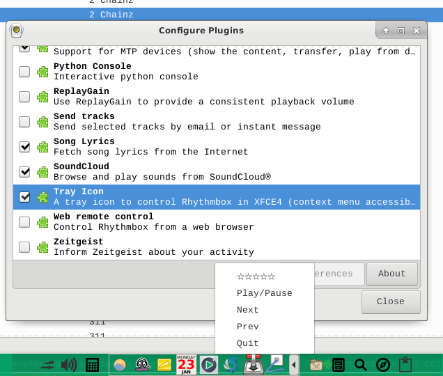

# rb-xfce4-plugin
(Rhythmbox-xfce4-plugin)

This is a simple fork of Mendhak's Rhythmbox tray icon plugin. XFCE4 does not support the default locations that notifications pop up. Additionally, as part of unrelated work, there are new icons based on the work of Andrea Soragna (see CREDITS).

## Installation 

`git clone https://github.com/paulmadore/rb-xfce4-plugin`

`mkdir ~/.local/share/rhythmbox/plugins/rb-xfce4-plugin`

`cp * ~/.local/share/rhythmbox/plugins/rb-xfce4-plugin`

Now, in *Rhythmbox*, go to Plugins > Configure Plugins window. Find "Tray Icon" and enable it. If the old Tray Icon is still enabled, you may want to disable it to avoid problems.

Result: screenshot.png

